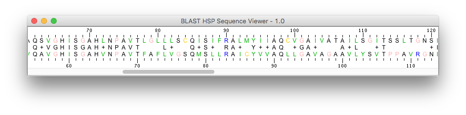

#Bioinformatics UI API

##Introduction

This package is a library of UI components:

* to display FeatureTable objects in appropriate table 
* to display SequenceInfo objects in appropriate viewer
* to display DNA/RNA/Protein Sequence objects in several viewers: text, graphic, HCA (protein only), etc.

In other words, this library is the appropriate friend of the [Bioinformatics Core library](https://github.com/pgdurand/Bioinformatics-Core-API).

Here is an example of use:

##Requirements

Use a [Java Virtual Machine](http://www.oracle.com/technetwork/java/javase/downloads/index.html) 1.7 (or above) from Oracle. 

*Not tested with any other JVM providers but Oracle... so there is no guarantee that the software will work as expected if not using Oracle's JVM.*

##Library uses

Since this package is a library, its primary purpose targets a use within other softwares. The package contains a quite large number of classes, most of them being actually supporting code to these viewers:

1. FeatureViewer: a viewer for FeatureTable objects
2. CartoViewerPanel: a graphical sequence viewer
3. PanelHCA: a protein sequence viewer relying on Hydrophobic Cluster Analysis (HCA)
4. DSequenceTableViewer: a sequence viewer relying on a table
5. AlphabetCounterXXXViewer: display letter content of a sequence (i.e. its composition)
6. CombinedSequenceViewer: combine viewers 2, 3 and 4 into a single one
7. CombinedSequenceViewerExt: combine viewers 2, 3, 4 and 5 into a single one
8. CombinedAnnotatedSequenceViewer: everything in a single full-featured viewer (above picture)

You can see how to use the library by having a look at the "example" source package. It contains sample source codes to illustrate the use of these components:

: see how to create a simple sequence viewer

: see how to load and display BLAST pairwise sequence alignments

: see how to create a graphic representation of a sequence

: see to create a combined sequence viewer

: see how to create a HCA view of a protein sequence

##License and dependencies

Bioinformatics UI API itself is released under the GNU Affero General Public License, Version 3.0. [AGPL](https://www.gnu.org/licenses/agpl-3.0.txt)

It depends on several thrid-party libraries as stated in the NOTICE.txt file provided with this project.

##Once upon a time was: VisualBlast

During Summer 2004 I was asking myself how easy it could be to rewrite in Java the original [VisualBlast software](http://www.ncbi.nlm.nih.gov/pubmed/9283755) written in C for the MS-Windows platform.

Actually, the answer was quite immediate: it took me a few days to fully rewrite Visual Blast, thanks to the many libraries available, mostly from Sun MicroSystems and the Apache Software Foundation.

So, during my holidays on Summer 2004, I started a wonderful story: the creation of what would eventually become the [KoriBlast/ngKLAST suite of softwares](http://plealog.com/korilog/product-sheets/ngKLAST.pdf), the founding software of my company, Korilog.

Korilog ceased its activities on June 2015, therefore I decided to release these UI components to the open source community. 

##Link with BioJava

Have in mind that this library can be a nice friend to [Biojava](http://biojava.org): Sequence objects from Biojava can be converted quite easily to Sequence objects from [Bioinformatics Core library](https://github.com/pgdurand/Bioinformatics-Core-API) for the purpose of using this [Bioinformatics UI library](https://github.com/pgdurand/Bioinformatics-UI-API). Got it ? No... then you are welcome to ask me! ;-)

--
(c) 2006-2016 - Patrick G. Durand
